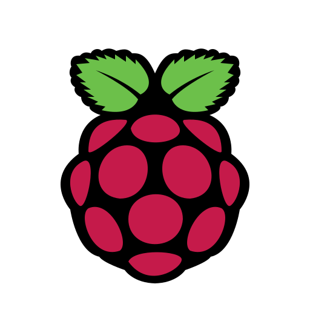

<h1 align="center">
🌐 My Web Page 🌐
</h1>

 <p align="center">
  <a href="https://the-young-programmer.github.io/The-Young-Programmer/"/> </a>
  <a href="https://the-young-programmer.github.io/The-Young-Programmer/"/></a>
  <a href="#"/></a>
  </p>
  
  <p align="center">
   
  <a href="mailto:the.young.programmer.team@gmail.com">
     
  </a>
  </p>
  
  <p align="center">
  
 [](https://git.io/typing-svg)
 </p>
  
  
  <h2 align="center">
 🎴 My Profile Card 🎴
 </h2>


<br />
<h2 align="center">
  👨‍💻 Languages | Tools | Experience  👨‍💻
 </h2>
 

<a href="#"/></a>
<a href="#"/></a>
<a href="#"/></a>
<a href="#"></a>
<a href="#"></a>
<a href="#"></a>
<a href="#"></a>
<a href="#"></a>
<a href="#"/></a>
<a href="#"></a>
<a href="#"></a>
<a href="#"></a>
<a href="#"></a>
<a href="#"/></a>
<a href="#"></a>
<a href="#"></a>
<a href="#"></a>
<a href="#"/></a>
<a href="#"></a>
<a href="#"></a>
<a href="#"></a>
<a href="#"></a>
<a href="#"></a>
<a href="#"/></a>
<a href="#"></a>
<a href="#"/></a>
<a href="#"></a>
<a href="#"/></a>
<a href="#"/></a>
<a href="#"/></a>
<a href="#"></a>
<a href="#"></a>
<a href="#"/></a>


<br />
<h2 align="center">
📖 Currently Learning 📖 
 </h2>
<a href="#"></a>
<a href="#"/></a>
<a href="#"></a>
<a href="#"></a>

<br />

<!--
<details> 
  <summary>📘 Some of my projects</summary>
  <br/>

  <p align="left">
  <a href="https://github.com/ericxlima/Hand_Gestures_LIBRAS">
      </a>
  <a href="https://github.com/ericxlima/Pandora_vs_UFPE">
      </a>
  <a href="https://github.com/ericxlima/Matrix_Processor">
      </a>
  </p>

 <p align="left">
  <a href="https://github.com/ericxlima?tab=repositories"></a>
</p>
</details>
-->


<br />
<h1 align="center">
📊 My Github Stats 📊
</h1>
 
<p align="center">
<a href="#"/></a> </p>
<p align="center">
<a href="#"/></a></p>
<p align="center">
<a href="#"/></a></p>

<b>Note:</b> Most used languages is only a metric of the languages my public code consists of and doesn't reflect experience or skill level.

<br />
<h2 align="center">
📊 Quote Of The Day 📊
</h2>

<!--START_SECTION:waka-->

```text

No Bug No Life.

```

<!--END_SECTION:waka-->
<br>


<p align="center">
<a href="#"/></a>
</p><br>

<h1 align="center">
 contact
</h1>

 <p align="center">
<a href="mailto:the.young.programmer.team@gmail.com"/></a>
<a href="https://www.instagram.com/t_nemonet"/></a>
<a href="https://twitter.com/tnemonet"/></a>
<a href="https://www.linkedin.com/in/typ-nemonet"/></a>


# 


