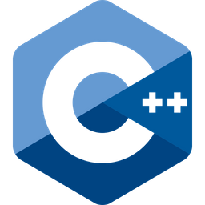
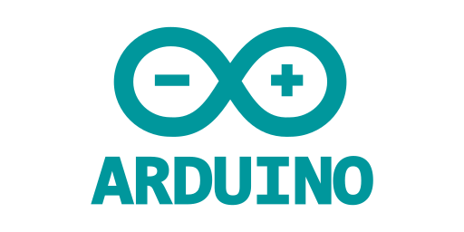

<!--
<h1 align="center">
🌐 My Web Page 🌐
</h1>
-->

 <p align="center">
  <a href="#"/> </a>
  <a href="https://the-young-programmer.github.io/The-Young-Programmer/"/></a>
  <a href="#"/></a>
  </p>

  
  <p align="center">
   
 <a href="https://github.com/The-Young-Programmer?tab=repositories&sort=stargazers">
    </a>
 <a href="mailto:the.young.programmer.team@gmail.com">
     
  </a>
  </p>

  <p align="center">
  <a href="https://github.com/The-Young-Programmer"></a>
</p>
  
  <!--
  <h2 align="center">
 🎴 My Profile Card 🎴
 </h2>


-->

 <br>


<br />
<h4 align="center">
  👨‍💻 Languages | Tools  👨‍💻
 </h4>
 

<a href="#"/></a>
<a href="#"/></a>
<a href="#"/></a>
<a href="#"></a>
<a href="#"></a>
<a href="#"></a>
<a href="https://angular.io/" target="_blank" rel="noreferrer"></a>
<a href="#"></a>
<a href="#"/></a>
<a href="#"></a>
<a href="#"></a>
<a href="https://www.oracle.com/java/" target="_blank" rel="noreferrer"></a>
<a href="https://kotlinlang.org/" target="_blank" rel="noreferrer"></a>
<a href="#"></a>
<a href="#"></a>
<a href="#"/></a>
<a href="#"></a>
<a href="#"></a>
<a href="#"></a>
<a href="#"/></a>
<a href="#"></a>
<a href="#"></a>
<a href="#"></a>
<a href="#"></a>
<a href="#"></a>
<a href="#"/></a>
<a href="#"></a>
<a href="#"></a>
<a href="#"></a>
<a href="#"></a>
<a href="#"></a>
<a href="#"></a>
<a href="#"></a>
<a href="#"></a>
<a href="#"/></a>
<a href="https://sass-lang.com/" target="_blank" rel="noreferrer"></a>
<a href="https://www.oracle.com/uk/index.html" target="_blank" rel="noreferrer"></a>
<a href="https://www.figma.com/" target="_blank" rel="noreferrer"></a>
<a href="https://www.adobe.com/uk/products/photoshop.html" target="_blank" rel="noreferrer"></a>
<a href="https://www.adobe.com/uk/products/aftereffects.html" target="_blank" rel="noreferrer"></a>
<a href="https://www.adobe.com/uk/products/xd.html" target="_blank" rel="noreferrer"></a>


<h4 align="left">
📖 Currently Learning 📖 
 </h4>

<a href="https://nodejs.org/en/" target="_blank" rel="noreferrer"></a>
<a href="#"></a>
<a href="https://developer.apple.com/swift/" target="_blank" rel="noreferrer"></a>
<a href="https://www.ruby-lang.org/en/" target="_blank" rel="noreferrer"></a>
<a href="https://go.dev/doc/" target="_blank" rel="noreferrer"></a>
<a href="https://firebase.google.com/" target="_blank" rel="noreferrer"></a>
<a href="https://flutter.dev/" target="_blank" rel="noreferrer"></a>

<br />

<details> 
 <summary> <h4> 🔰 Some of my projects </h4><hr></summary>
  <br/>

  <p align="left">
  <a href="https://github.com/The-Young-Programmer/Math-Quize">
      </a>
  <a href="https://github.com/The-Young-Programmer/Hangman-Game">
      </a>
  <a href="https://github.com/The-Young-Programmer/C-CPP-Programming-Project">
      </a>
  
  </p>

 <p align="left">
  <a href="https://github.com/The-Young-Programmer?tab=repositories"></a>
</p>
</details>


<h4 align="center">
📊 My Github Stats 📊
</h4>
 
 <div align="center">
<a href="http://www.github.com/The-Young-Programmer"></a>
<a href="http://www.github.com/The-Young-Programmer"></a>
<a href="http://www.github.com/The-Young-Programmer"/></a>
</div>

<p>
<b>Note:</b> Most used languages is only a metric of the languages my public code consists of and doesn't reflect experience or skill level.
</p>

<!--
<h2 align="center">
📊 Quote Of The Day 📊
</h2>-->

<!--START_SECTION:waka-->
<!--
```text

No Bug No Life.

```
-->
<!--END_SECTION:waka-->


<h4 align="left">
 contact
</h4>
<p align="left">
 <a href="https://www.instagram.com/t_nemonet" target="_blank" rel="noreferrer"></a>
 <a href="https://www.linkedin.com/in/typ-nemonet" target="_blank" rel="noreferrer"></a>
 <a href="https://twitter.com/tnemonet" target="_blank" rel="noreferrer"></a>
 <a href="https://www.github.com/The-Young-Programmer" target="_blank" rel="noreferrer"></a></p>

<h4>Support Me</h4>

<a href="https://www.buymeacoffee.com/The-Young-Programmer"></a>


 


